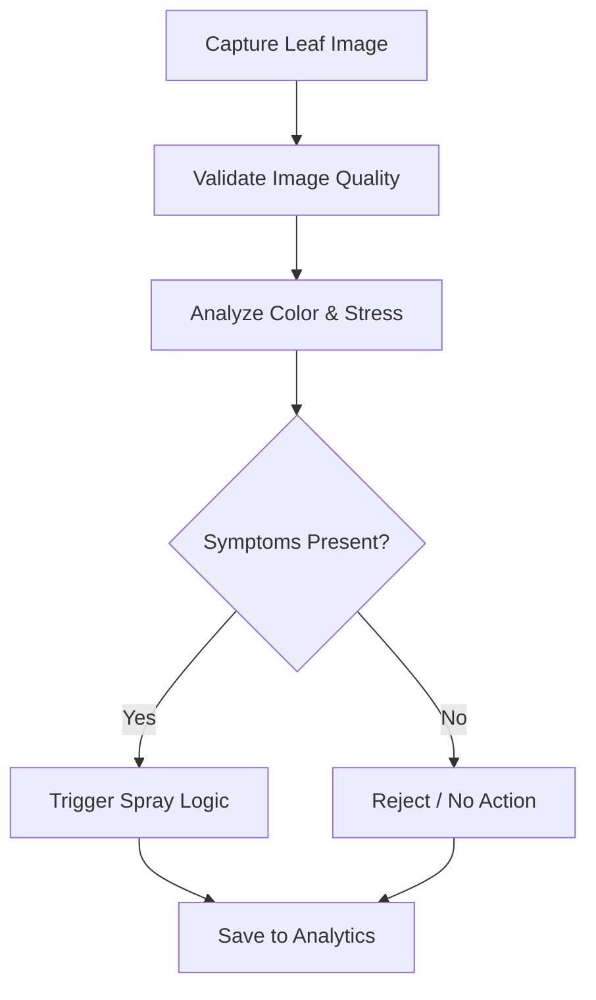

# 🌿 AgriSpray AI

  Smart Pesticide Spraying System for Precision Agriculture

  FILES UPLOADINNG SOON

  
  
  
  
  

---

## 📌 About

AgriSpray AI is a smart pesticide spraying system interface built for **precision agriculture**. It helps users capture live leaf images, analyze visible symptoms, and review scan analytics through a modern web dashboard.

The project focuses on **reducing unnecessary pesticide usage** by supporting **targeted decisions instead of blanket spraying**.

---

## 🚀 Overview

This application provides:

✨ live camera-based leaf capture  
✨ on-device visual symptom screening  
✨ scan history with real-time analytics  
✨ weekly reporting and disease distribution charts  
✨ system flow and technology overview pages  
✨ responsive UI with light and dark mode  

---

## ✨ Key Features

### 📷 Live Detection
Opens the device camera, captures a leaf frame, validates image quality, and checks for visible symptoms.

### 🧠 Smart Validation
Rejects scans when:
- no clear leaf is detected  
- frame is too dark  
- blurry image  
- overexposed capture  

### 📊 Real-Time Analytics
Stores valid scans locally and updates dashboard numbers and charts from real scan history.

### 🎨 Interactive UI
Includes:
- smooth animations  
- themed navigation  
- polished cards  
- tab-based analytics views  

### 🌗 Theme Support
Users can switch between **light and dark mode**.

---

## 🔄 System Flow

The intended workflow is:

### 👨‍💻 Contributors
- SHUBHAM RATHOD
- SHAIKH RIZWAN
